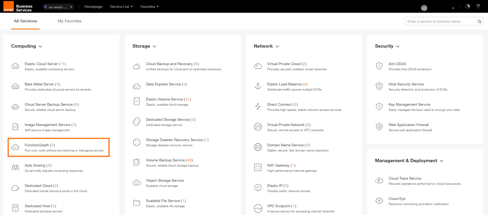
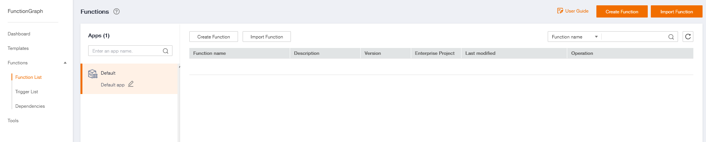
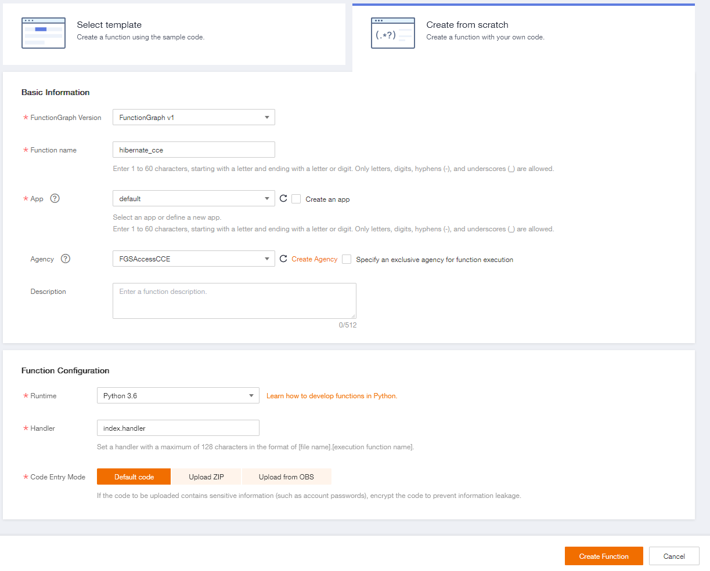
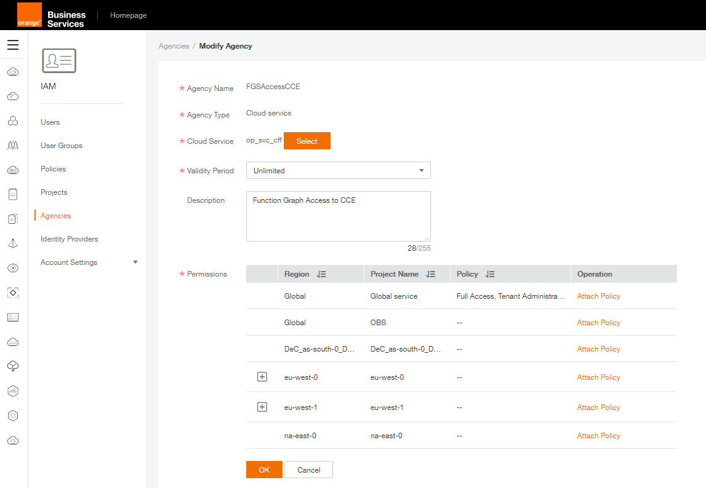
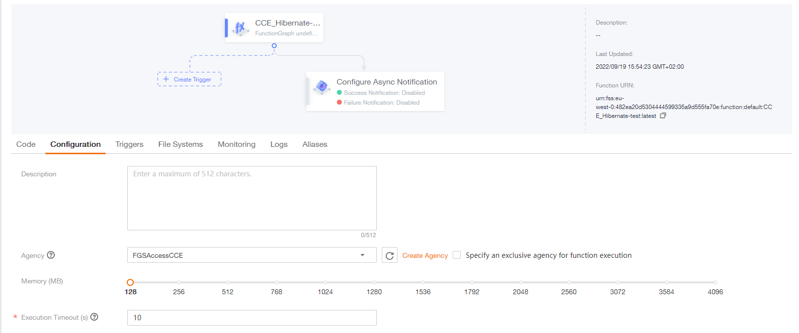
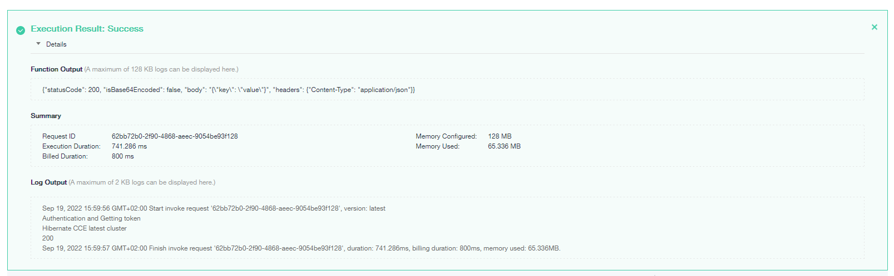
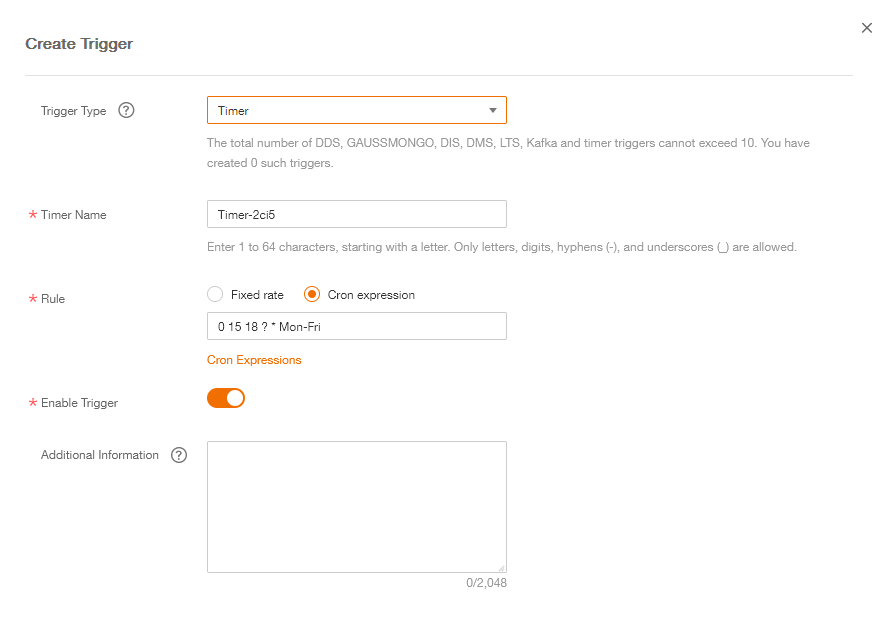

# Version Supported

This document is based on Cloud Container Engine version 1.23 and Function Graph 1.0

# Introduction

In this document we will introduce our serverless service called FunctionGraph and use it to automate the hibernation of our Cloud Container Engine (CCE) cluster using API call.

# FunctionGraph

## Presentation

FunctionGraph is a Function as a Service solution that hosts and  computes event-driven functions in a serverless context while ensuring  high availability, high scalability, and zero maintenance. All you need  to do is write your code and set conditions. You pay only for what you  use and you are not charged when your code is not running.

**Feature page** : https://cloud.orange-business.com/en/offers/infrastructure-iaas/public-cloud/features/functiongraph/

You can find our related documentation on our online Helpcenter : https://docs.prod-cloud-ocb.orange-business.com/usermanual/functiongraph/functiongraph_01_0504.html


## Create a function

In FE console, under Computing, Select FunctionGraph



In FunctionGraph menu, select Functions then Functions List

and Create Function



### Settings

Add a Function name

Select the agency created previously

Select Python 3.6 as Runtime

Then click on Create Function



### Code

Now that we created our function, we can use the online IDE to edit the code.

The following example hibernate a CCE cluster through an API call but you can also customize the code, using the API documentation :

https://docs.prod-cloud-ocb.orange-business.com/index.html

In the code, replace YOUR_CLUSTER_ID by the ID of your own CCE cluster

example : 9850adc3-2843-11ed-94cc-0255ac101f5a

```python
# -*- coding:utf-8 -*-
import json
import requests

def handler (event, context):
    Endpoint = "eu-west-0.prod-cloud-ocb.orange-business.com"     
    Project = context.getProjectID()              
    print("Authentication and Getting token")
    token = context.getToken()
     
    
    print("Hibernate CCE latest cluster")
    url = f"https://cce.{Endpoint}/api/v3/projects/{Project}/clusters/YOUR_CLUSTER_ID/operation/hibernate"
    payload={}
    headers = {
    'Content-Type': 'application/json',
    'X-Auth-Token': token,
    'X-Cluster-UUID': 'YOUR_CLUSTER_ID'
    }
    response = requests.request("POST", url, headers=headers, data=payload)
    print(response.status_code)
    print(response.text)
    return {
        "statusCode": 200,
        "isBase64Encoded": False,
        "body": json.dumps(event),
        "headers": {
            "Content-Type": "application/json"
        }
    }

```


### Configuration

In the configuration tab, you can configure encryption settings and environment variables to dynamically pass settings to your function code and libraries without changing your code.

Depending on your use case you will need to create and IAM Agency in order to :

- Allow FunctionGraph to interact with the targeted services (CCE in our example)
- Create a token for authentication

More details about Agencies : https://docs.prod-cloud-ocb.orange-business.com/usermanual/functiongraph/functiongraph_01_0920.html


Here is an example of how to configure an IAM Agency to allow FunctionGraph to access Cloud Container Engine service

- In Flexible Engine console go to Identity and Access Management
- Select Agencies
- Click on Create agency on the top right of the screen
  - Agency Name : FGSAccessCCE (or name of your choice) 
  - Agency type : Select Cloud service
  - Cloud Service : FunctionGraph
  - Validy Period : Unlimited
- Then attach the Agency to your domain/project




After creating your IAM Agency, go back to your Function configuration and select your Agency

Finally you can also customize the function's associated Memory ,Execution Timeout and Environment variable... 



### Test

Now we can test our function with Test button at the top right of the screen.

If everything is well configured, results shoud look as below :




### Trigger

FunctionGraph applications are composed of functions and event sources. Event sources are cloud services or user-defined applications that publish events, and functions are custom code for processing events.

FunctionGraph functions can be triggered by multiple cloud services. After you configure event sources to trigger your functions, FunctionGraph automatically invokes  the functions when events occur.

In our example we use a Timer with a Cron expression to trigger the Function.

```cron
0 15 18 ? * Mon-Fri
```

More details about Cron expressions :

https://docs.prod-cloud-ocb.orange-business.com/usermanual/functiongraph/functiongraph_01_0908.html


